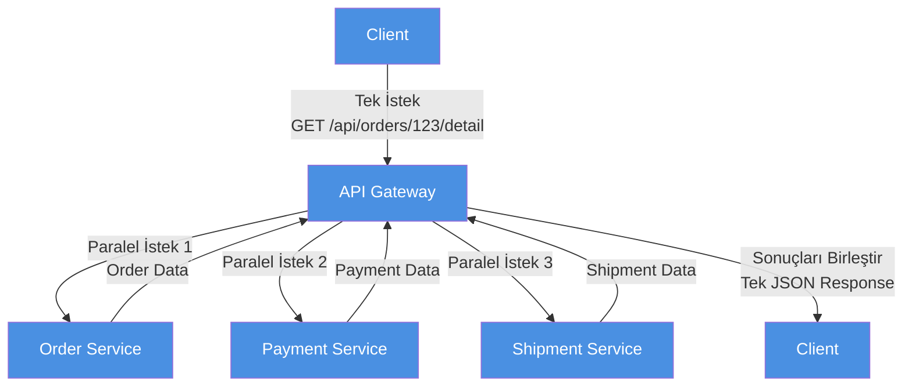

# API Gateway

**API Gateway**, özellikle *microservice* mimarisinde, tüm istemciler (web, mobil, partner) için **tek bir giriş kapısı** gibi çalışan katmandır. İstemciden gelen istekleri alır ve ya **doğru servise yönlendirir (proxy/routing)** ya da bazı senaryolarda **birden fazla servisi çağırıp sonucu birleştirerek** tek cevap döner (fan-out/aggregation).

---

## 1. API Gateway Nedir? (Basit Tanım)

Kısa cevap:

> **API Gateway = Tüm istemciler için tek bir giriş noktası (single entry point)**

> **Microservice'lerin önünde duran, istekleri yönlendiren, ortak işleri (auth, rate limit, cache) yapan katman.**

Basit akış:

```
Web/Mobil/Partner İstemciler
         |
         v
    API Gateway  (auth, rate limit, cache, log, transform)
     /   |    \
    v    v     v
User  Order  Payment  (microservice'ler)
```

**Felsefe:**

* İstemci (web, mobil, partner API) → **10 farklı servisi bilmek zorunda değil**
* İstemci → **Sadece API Gateway'i bilir** → Gateway içerideki servislere yönlendirir
* Ortak işler (kimlik doğrulama, rate limiting, logging) → **Tek yerde** yapılır

---

## 2. Neden Kullanılır? (Ne Çözer?)

### 2.1 Tek Entry Point (Giriş Noktası)

**Problem:**
* İstemci (mobil uygulama) sipariş detayı için:
  * `OrderService` → `/api/orders/{id}`
  * `PaymentService` → `/api/payments?orderId={id}`
  * `ShipmentService` → `/api/shipments?orderId={id}`
  * Her servisin adresini, portunu, endpoint'lerini bilmek zorunda

**Çözüm:**
* İstemci → Sadece `api-gateway.example.com` bilir
* `GET /api/orders/{id}` → Gateway içeride 3 servisi çağırıp sonucu birleştirir
* İstemci **tek bir istek** yapar, **tek bir cevap** alır

### 2.2 Ortak İşler Tek Yerde (Cross-Cutting Concerns)

API Gateway, her istekte yapılması gereken ortak işleri üstlenir:

#### **Authentication / Authorization**
* Her servis kendi başına JWT token kontrolü yapmak zorunda değil
* Gateway'de **bir kez** kontrol edilir → geçerliyse backend'e yönlendirilir
* Geçersizse → 401/403 döner, backend'e hiç gitmez

#### **Rate Limiting / Throttling**
* Ani yük (spike) ve kötüye kullanım engeli
* Örn: Kullanıcı başına dakikada 100 istek limiti
* Limit aşılırsa → 429 Too Many Requests döner
* Backend servisler **gereksiz yük** almaz

#### **Caching**
* Backend'e giden çağrıları azaltır, latency düşer
* Örn: `GET /api/products` → Gateway cache'den döner (5 dk TTL)
* Backend servis çağrılmaz → **daha hızlı cevap**, **daha az yük**

#### **Request/Response Transformation**
* Header ekleme (örneğin correlation ID, user context)
* Format çevirme (XML → JSON)
* Versiyonlama (v1 → v2 mapping)
* Response birleştirme (aggregation)

#### **Logging & Monitoring**
* Tüm isteklerin loglanması, metrik toplama
* Distributed tracing için correlation ID ekleme
* Gözlemlenebilirlik (observability) için merkezi nokta

---

## 3. Basit Örnek Senaryo

### Senaryo: Mobil Uygulama "Sipariş Detayı" Ekranı

**API Gateway olmadan:**
```
Mobil App
  → GET http://order-service:8080/api/orders/123
  → GET http://payment-service:8081/api/payments?orderId=123
  → GET http://shipment-service:8082/api/shipments?orderId=123
```

**Problemler:**
* 3 farklı servis adresi bilmek zorunda
* 3 ayrı HTTP isteği → 3 ayrı network round-trip
* Her servis kendi auth kontrolü yapıyor
* Mobil uygulama güncellemesi gerekiyor (servis adresi değişirse)

**API Gateway ile:**
```
Mobil App
  → GET https://api.example.com/orders/123
    ↓
  API Gateway
    ├─→ OrderService: /api/orders/123
    ├─→ PaymentService: /api/payments?orderId=123
    └─→ ShipmentService: /api/shipments?orderId=123
    ↓
  Gateway sonuçları birleştirir (aggregation)
    ↓
  Tek JSON response döner
```

**Kazançlar:**
* İstemci **tek bir istek** yapar
* Gateway **fan-out** yapıp sonuçları birleştirir
* Ortak işler (auth, rate limit) **tek yerde**
* Servis adresleri değişse bile istemci etkilenmez

---

## 4. API Gateway vs Load Balancer vs Reverse Proxy

### 4.1 Load Balancer

**Odak:** Trafik dağıtma (traffic distribution)

* Aynı servisin **birden fazla instance'ı** var
* Load balancer → istekleri **instance'lar arasında dağıtır**
* Örn: `OrderService` → 3 instance (order-1, order-2, order-3)
* Load balancer → round-robin / least-connections ile dağıtır

**Özellikler:**
* Health check (hangi instance sağlıklı?)
* Session affinity (sticky session)
* SSL termination

**API Gateway ile farkı:**
* Load balancer → **aynı servisin instance'ları** arasında dağıtır
* API Gateway → **farklı servislere** yönlendirir + **API seviyesinde kurallar** (auth, rate limit, transform)

### 4.2 Reverse Proxy

**Odak:** İstekleri arka plandaki servislere yönlendirme

* Nginx, HAProxy gibi araçlar
* URL path'e göre routing yapar
* Örn: `/api/users` → `user-service:8080`, `/api/orders` → `order-service:8081`

**API Gateway ile farkı:**
* Reverse proxy → **basit routing** (URL → backend mapping)
* API Gateway → **routing + API seviyesinde işler** (auth, rate limit, cache, aggregation, transform)

**Not:** Bazı API Gateway'ler (örneğin Kong, Tyk) reverse proxy özelliklerini de içerir.

### 4.3 API Gateway

**Odak:** API seviyesinde kurallar, policies, plugins

* **Routing** (hangi servise gidecek?)
* **Authentication/Authorization** (kimlik doğrulama)
* **Rate Limiting** (istek sınırlama)
* **Caching** (cevap önbellekleme)
* **Request/Response Transformation** (dönüşüm)
* **Aggregation** (birden fazla servisi çağırıp birleştirme)
* **Logging & Monitoring** (gözlemlenebilirlik)

**Özet:**
* Load Balancer → **Aynı servisin instance'ları** arasında dağıtma
* Reverse Proxy → **Basit routing** (URL → backend)
* API Gateway → **Routing + API seviyesinde policies** (auth, rate limit, cache, transform, aggregation)

---

## 5. API Gateway Mimarisi (Detaylı Diyagram)

### 5.1 Temel Mimari

**Basit Akış:**
```
İstemciler (Web/Mobil/Partner)
         ↓
    API Gateway
    (Auth + Rate Limit + Cache)
         ↓
    Backend Servisler
    (User/Order/Payment)
```

**Detaylı Akış:**
```
┌─────────────────────────────────────────┐
│   İstemciler (Web/Mobil/Partner)        │
└──────────────────┬──────────────────────┘
                   │ İstek
                   ↓
         ┌──────────────────────┐
         │   API Gateway        │
         └──────────┬───────────┘
                    │
        ┌───────────┴───────────┐
        │  1. Auth Kontrolü     │
        └───────────┬───────────┘
                    │
        ┌───────────┴───────────┐
        │   Geçerli mi?         │
        └───┬───────────────┬───┘
            │               │
         Hayır            Evet
            │               │
            ↓               ↓
    ┌───────────┐   ┌──────────────┐
    │ 401 Hata  │   │ 2. Rate Limit│
    └───────────┘   └──────┬───────┘
                           │
              ┌────────────┴────────────┐
              │                         │
         Limit aşıldı              OK
              │                         │
              ↓                         ↓
      ┌───────────┐            ┌──────────────┐
      │ 429 Hata  │            │ 3. Routing  │
      └───────────┘            └──────┬──────┘
                                       │
                                       ↓
                            ┌──────────────────────┐
                            │  Backend Servisler   │
                            │ (User/Order/Payment) │
                            └──────────┬───────────┘
                                       │ Cevap
                                       ↓
                            ┌──────────────────────┐
                            │   API Gateway        │
                            └──────────┬───────────┘
                                       │ Response
                                       ↓
                            ┌──────────────────────┐
                            │     İstemciler       │
                            └──────────────────────┘
```

### 5.2 Request Flow (İstek Akışı)

**Basit Adımlar:**
```
1. Client → Gateway: İstek gönder (Token ile)
2. Gateway → Auth kontrolü yap
3. Gateway → Rate limit kontrolü yap
4. Gateway → Cache'e bak (varsa cache'den dön)
5. Gateway → Backend servise yönlendir
6. Backend → Gateway: Cevap döner
7. Gateway → Cache'e yaz (gelecek istekler için)
8. Gateway → Client: Response döner
```

**Detaylı İstek Akışı:**
```
Client          API Gateway          Backend Service
  │                  │                      │
  │ [1] İstek        │                      │
  │ (Token ile)      │                      │
  ├─────────────────>│                      │
  │                  │                      │
  │                  │ [2] Token kontrolü  │
  │                  │<───┐                │
  │                  │    │                │
  │                  │ [3] Rate limit      │
  │                  │<───┘                │
  │                  │                      │
  │                  │ Cache kontrolü      │
  │                  │<───┐                │
  │                  │    │                │
  │                  │    │                │
  │     ┌────────────┴────┴────────────┐   │
  │     │                             │   │
  │     │  Cache'de VAR mı?          │   │
  │     │                             │   │
  │     │  EVET                       │   │
  │     │  [4] Cache'den dön         │   │
  │     │                             │   │
  │     │  HAYIR                      │   │
  │     │  [6] Backend'e gönder       │   │
  │     │                             │   │
  │     └────────────┬────────────────┘   │
  │                  │                      │
  │                  ├─────────────────────>│
  │                  │                      │
  │                  │ [7] Cevap           │
  │                  │<─────────────────────┤
  │                  │                      │
  │                  │ [8] Cache'e yaz     │
  │                  │<───┐                │
  │                  │    │                │
  │                  │ [9] Cevap           │
  │                  │                      │
  │ [5/9] Cevap      │                      │
  │<─────────────────┤                      │
  │                  │                      │
```

### 5.3 Fan-Out / Aggregation Senaryosu

**Basit Açıklama:**
```
Client: "Sipariş detayı istiyorum"
  ↓
API Gateway: "3 servisi paralel çağırayım"
  ├─→ Order Service
  ├─→ Payment Service
  └─→ Shipment Service
  ↓
Gateway: Sonuçları birleştir
  ↓
Client: Tek JSON response alır
```

**Diyagram:**


**Açıklama:**
1. **Client** → API Gateway'e **tek bir istek** gönderir
2. **API Gateway** → 3 servisi **paralel** olarak çağırır (fan-out)
3. Her servis → Kendi **data**'sını Gateway'e döner
4. **API Gateway** → Tüm sonuçları **birleştirir** (aggregation)
5. **Client** → **Tek bir JSON response** alır

---

## 6. API Gateway Özellikleri (Detaylı)

### 6.1 Request Routing (İstek Yönlendirme)

**Ne yapar?**
* Gelen isteği **path, method, header** gibi kriterlere göre doğru backend servisine yönlendirir

**Örnek:**
```
GET /api/users/*     → UserService:8080
GET /api/orders/*    → OrderService:8081
POST /api/payments/* → PaymentService:8082
```

**Avantaj:**
* Backend servislerin adresleri değişse bile istemci etkilenmez
* A/B testing için farklı versiyonlara yönlendirme yapılabilir
* Canary deployment (kademeli yayınlama) için trafik dağıtımı

### 6.2 Authentication / Authorization

**Authentication (Kimlik Doğrulama):**
* JWT token kontrolü
* API key kontrolü
* OAuth 2.0 / OpenID Connect

**Authorization (Yetkilendirme):**
* Kullanıcının **hangi endpoint'lere erişebileceğini** kontrol eder
* Role-based access control (RBAC)
* Policy-based authorization

**Örnek Akış:**
```
1. Client → Gateway: GET /api/orders (Bearer Token)
2. Gateway → Auth Service: Token'ı doğrula
3. Auth Service → Gateway: Token geçerli, user:123, roles:["customer"]
4. Gateway → Policy Check: "customer" rolü /api/orders'a erişebilir mi? ✅
5. Gateway → Order Service: İsteği yönlendir (user context ile)
```

**Avantaj:**
* Her backend servis kendi auth kontrolünü yapmak zorunda değil
* Merkezi güvenlik politikaları
* Token'lar backend servislere **sadece geçerliyse** iletilir

### 6.3 Rate Limiting / Throttling

**Ne çözer?**
* Ani yük (spike) koruması
* Kötüye kullanım engeli (DDoS benzeri)
* API kullanımını sınırlama (ücretlendirme modeli için)

**Stratejiler:**
* **Per-user rate limiting:** Kullanıcı başına dakikada 100 istek
* **Per-IP rate limiting:** IP başına saatte 1000 istek
* **Per-endpoint rate limiting:** `/api/orders` endpoint'i için özel limit
* **Sliding window:** Son N dakikadaki istek sayısına bak
* **Token bucket:** Belirli bir "token" sayısı, her istekte token tüketilir

**Örnek:**
```
User:123 → /api/orders → 100 req/min limit
İstek 1-100: ✅ 200 OK
İstek 101: ❌ 429 Too Many Requests
Retry-After: 60 (60 saniye sonra tekrar dene)
```

**Avantaj:**
* Backend servisler **aşırı yük** almaz
* Sistemin **stabil kalması** sağlanır
* Adil kullanım (fair usage) garantisi

### 6.4 Caching

**Ne yapar?**
* Backend'den gelen cevapları **belirli bir süre** saklar
* Aynı istek tekrar gelirse → **cache'den döner**, backend çağrılmaz

**Stratejiler:**
* **Time-based caching:** 5 dakika TTL (Time To Live)
* **Key-based caching:** URL + query params → cache key
* **Invalidation:** Veri değiştiğinde cache'i temizle

**Örnek:**
```
GET /api/products?category=electronics
  → İlk istek: Backend'den al (500ms)
  → Cache'e yaz (TTL: 5 min)
  → Sonraki istekler (5 dk içinde): Cache'den dön (10ms) ⚡
```

**Avantaj:**
* **Latency düşer** (ms → sub-ms)
* **Backend yükü azalır**
* **Maliyet düşer** (daha az backend çağrısı)

### 6.5 Request/Response Transformation

**Request Transformation:**
* Header ekleme (örneğin correlation ID, user context)
* Query parameter ekleme/değiştirme
* Body format çevirme (XML → JSON)

**Response Transformation:**
* Response format değiştirme (JSON → XML)
* Field mapping (backend field → client field)
* Versiyonlama (v1 → v2 mapping)

**Örnek:**
```
Client Request:
  GET /api/v2/users/123

Gateway Transformation:
  → Backend: GET /api/users/123?version=2
  → Header ekle: X-User-Context: {userId: 123, role: "admin"}
  → Response: v2 format'a çevir
```

### 6.6 Aggregation (Birleştirme)

**Ne yapar?**
* Birden fazla backend servisini **paralel** çağırır
* Sonuçları **birleştirip** tek response döner

**Örnek Senaryo:**
```
Client: GET /api/orders/123/detail

Gateway:
  1. OrderService → /api/orders/123
  2. PaymentService → /api/payments?orderId=123
  3. ShipmentService → /api/shipments?orderId=123

Gateway Response:
  {
    "order": {...},
    "payment": {...},
    "shipment": {...}
  }
```

**Avantaj:**
* İstemci **tek bir istek** yapar
* **Network round-trip** sayısı azalır
* **Latency** düşer (paralel çağrılar)

### 6.7 Logging & Monitoring

**Ne yapar?**
* Tüm istekleri **loglar**
* **Metrikler** toplar (request count, latency, error rate)
* **Distributed tracing** için correlation ID ekler

**Örnek Metrikler:**
* Request per second (RPS)
* Latency (p50, p95, p99)
* Error rate (4xx, 5xx)
* Rate limit hits
* Cache hit ratio

**Avantaj:**
* **Merkezi gözlemlenebilirlik**
* **Problem tespiti** kolaylaşır
* **Performance analizi** yapılabilir

---

## 7. API Gateway Dezavantajları (Bilmek İyi Olur)

### 7.1 Ek Bir "Hop" (Katman)

**Problem:**
* İstek → Gateway → Backend → Gateway → İstemci
* Her katman **latency ekler** (az da olsa)

**Çözüm:**
* Gateway'i **optimize et** (connection pooling, async işlemler)
* **Co-location:** Gateway'i backend servislere yakın tut
* **Caching:** Sık kullanılan istekleri cache'le

### 7.2 Bottleneck / Tek Nokta Riski

**Problem:**
* Gateway **tek bir nokta** (single point of failure)
* Gateway çökerse → **tüm sistem** erişilemez olur

**Çözüm:**
* **High availability:** Birden fazla Gateway instance (load balancer arkasında)
* **Horizontal scaling:** Gateway'i ölçeklendir (auto-scaling)
* **Circuit breaker:** Backend servis çökerse Gateway'i koru

### 7.3 "Her Şeyi Buraya Koyma" Riski

**Problem:**
* Gateway'e **çok fazla iş mantığı** koyarsan → yeni bir "mini monolith" olur
* Gateway **şişer**, bakımı zorlaşır

**Çözüm:**
* Gateway'i **ince tut** (thin gateway)
* **Sadece cross-cutting concerns** (auth, rate limit, routing)
* **İş mantığı** → Backend servislerde kalmalı

**Örnek:**
```
❌ Kötü: Gateway'de sipariş validasyonu, stok kontrolü
✅ İyi: Gateway'de sadece auth, rate limit, routing
```

---

## 8. API Gateway Ne Zaman Kullanılır?

### 8.1 Microservice Mimarisi

**Senaryo:**
* 10+ microservice var
* Her servis farklı adres/port
* İstemciler (web, mobil, partner) → **tek bir noktadan** erişmeli

**Çözüm:**
* API Gateway → **tek entry point**
* İstemciler → Sadece Gateway'i bilir
* Gateway → Backend servislere yönlendirir

### 8.2 Monolith + Tek API

**Senaryo:**
* Tek bir monolith uygulama var
* İstemciler → Direkt monolith'e bağlanıyor

**Soru:** API Gateway gerekli mi?

**Cevap:** **Genelde gerekli değil**, ama şu durumlarda faydalı:
* **Rate limiting** istiyorsan
* **Authentication** merkezi yapmak istiyorsan
* **Caching** eklemek istiyorsan
* **Logging/monitoring** merkezi yapmak istiyorsan

**Alternatif:**
* Basit bir **reverse proxy** (Nginx) yeterli olabilir
* Veya **API Gateway** kullan ama daha basit konfigürasyon

### 8.3 Karar Ağacı

```
Sistemin yapısı nedir?
│
├─ Microservice (10+ servis)
│  └─→ API Gateway ÖNERİLİR ✅
│     (tek entry point, ortak işler, aggregation)
│
├─ Monolith + Tek API
│  ├─ Rate limiting / Auth / Cache gerekli mi?
│  │  ├─ Evet → API Gateway veya Reverse Proxy ✅
│  │  └─ Hayır → Direkt bağlantı yeterli ❌
│  │
│  └─ İleride microservice'e geçecek misin?
│     ├─ Evet → API Gateway kullan (hazırlık) ✅
│     └─ Hayır → Gereksiz karmaşıklık ❌
│
└─ Hybrid (Monolith + Birkaç Microservice)
   └─→ API Gateway ÖNERİLİR ✅
      (tutarlılık, merkezi yönetim)
```

---

## 9. Popüler API Gateway Çözümleri

### 9.1 Kong

**Özellikler:**
* Açık kaynak
* Plugin mimarisi (auth, rate limit, cache, transform)
* Nginx tabanlı (yüksek performans)
* Kong Manager (GUI yönetim arayüzü)

**Kullanım:**
* Docker ile kolay kurulum
* YAML/JSON ile konfigürasyon
* REST API ile yönetim

### 9.2 AWS API Gateway

**Özellikler:**
* Managed service (yönetilen hizmet)
* Serverless (kullanıldığı kadar öde)
* AWS Lambda entegrasyonu
* Auto-scaling

**Kullanım:**
* AWS ekosistemi içinde
* CloudFormation / Terraform ile yönetim
* AWS IAM ile güvenlik

### 9.3 Azure API Management (APIM)

**Özellikler:**
* Microsoft'un managed API Gateway'i
* Developer portal (API dokümantasyonu)
* Policy-based yapılandırma
* Multi-cloud desteği

**Kullanım:**
* Azure ekosistemi içinde
* Portal veya ARM template ile yönetim

### 9.4 Ocelot (.NET)

**Özellikler:**
* .NET tabanlı, açık kaynak
* .NET Core ile native entegrasyon
* Basit konfigürasyon (JSON)
* Middleware pattern

**Kullanım:**
* .NET projelerinde
* `Ocelot` NuGet paketi
* `Program.cs` içinde middleware olarak

**Örnek:**
```csharp
// Program.cs
builder.Services.AddOcelot();

var app = builder.Build();
app.UseOcelot().Wait();
```

### 9.5 YARP (Yet Another Reverse Proxy)

**Özellikler:**
* Microsoft'un açık kaynak reverse proxy'si
* .NET tabanlı
* Yüksek performans
* Basit konfigürasyon

**Kullanım:**
* .NET projelerinde
* `Yarp.ReverseProxy` NuGet paketi
* Routing, load balancing, health checks

---

## 10. Pratik Örnek: E-Ticaret Senaryosu

### Senaryo: E-Ticaret Platformu

**Mimari:**
```
Web App / Mobil App
      ↓
  API Gateway (Kong)
      ↓
  ┌───┴───┬─────────┬──────────┐
  ↓       ↓         ↓          ↓
User   Order    Payment   Inventory
Service Service  Service   Service
```

**API Gateway Konfigürasyonu:**

**1. Routing:**
```
GET  /api/users/*      → UserService:8080
GET  /api/orders/*    → OrderService:8081
POST /api/payments/*  → PaymentService:8082
GET  /api/products/*  → InventoryService:8083
```

**2. Authentication:**
```
Tüm istekler → JWT token kontrolü
Token geçersiz → 401 Unauthorized
Token geçerli → Backend'e yönlendir (user context ile)
```

**3. Rate Limiting:**
```
Per-user: 100 req/min
Per-IP: 1000 req/hour
```

**4. Caching:**
```
GET /api/products → 5 min TTL
GET /api/products/{id} → 10 min TTL
```

**5. Aggregation:**
```
GET /api/orders/{id}/detail
  → OrderService: /api/orders/{id}
  → PaymentService: /api/payments?orderId={id}
  → ShipmentService: /api/shipments?orderId={id}
  → Birleştirip tek response dön
```

---

## 11. Özet

### 🔹 API Gateway Nedir?
Tüm istemciler için **tek bir giriş kapısı** gibi çalışan, microservice mimarisinde istekleri yönlendiren, ortak işleri (auth, rate limit, cache) yapan katman.

### 🔹 Neden Kullanılır?
* **Tek entry point:** İstemci 10 servisi tek tek bilmek zorunda değil
* **Ortak işler tek yerde:** Authentication, rate limiting, caching, logging
* **Request aggregation:** Birden fazla servisi çağırıp sonucu birleştirme
* **Request/response transformation:** Header ekleme, format çevirme, versiyonlama

### 🔹 Temel Özellikler:
* **Request Routing:** İstekleri doğru backend servisine yönlendirme
* **Authentication/Authorization:** Kimlik doğrulama ve yetkilendirme
* **Rate Limiting:** İstek sınırlama (spike koruması, kötüye kullanım engeli)
* **Caching:** Backend yükünü azaltma, latency düşürme
* **Transformation:** Request/response dönüşümü
* **Aggregation:** Birden fazla servisi çağırıp birleştirme
* **Logging & Monitoring:** Merkezi gözlemlenebilirlik

### 🔹 Load Balancer / Reverse Proxy ile Farkı:
* **Load Balancer:** Aynı servisin instance'ları arasında trafik dağıtma
* **Reverse Proxy:** Basit routing (URL → backend)
* **API Gateway:** Routing + API seviyesinde policies (auth, rate limit, cache, transform, aggregation)

### 🔹 Dezavantajlar:
* **Ek bir "hop":** Latency ekler (az da olsa)
* **Bottleneck riski:** Tek nokta başarısızlığı (high availability gerekli)
* **"Her şeyi buraya koyma" riski:** Gateway'i ince tut, iş mantığı backend'de kalsın

### 🔹 Ne Zaman Kullanılır?
* **Microservice mimarisi:** 10+ servis → API Gateway önerilir ✅
* **Monolith + tek API:** Rate limiting/auth/cache gerekliyse → API Gateway veya Reverse Proxy ✅
* **Basit monolith:** Gereksiz karmaşıklık olabilir ❌

### 🔹 Popüler Çözümler:
* **Kong:** Açık kaynak, plugin mimarisi
* **AWS API Gateway:** Managed service, serverless
* **Azure API Management:** Microsoft'un managed çözümü
* **Ocelot:** .NET tabanlı, açık kaynak
* **YARP:** Microsoft'un reverse proxy'si

---

## 12. Kaynaklar

* [microservices.io - API Gateway Pattern](https://microservices.io/patterns/apigateway.html)
* [Microsoft Learn - API Management Policies](https://learn.microsoft.com/en-us/azure/api-management/api-management-howto-policies)
* [AWS API Gateway - Request Throttling](https://docs.aws.amazon.com/apigateway/latest/developerguide/api-gateway-request-throttling.html)
* [AWS API Gateway - Caching](https://docs.aws.amazon.com/apigateway/latest/developerguide/api-gateway-caching.html)

---

**Son Not:** API Gateway, özellikle microservice mimarisinde **vazgeçilmez** bir katmandır. Ancak **doğru kullanıldığında** faydalıdır; gereksiz karmaşıklık eklememek için **ihtiyaca göre** karar verilmelidir.

