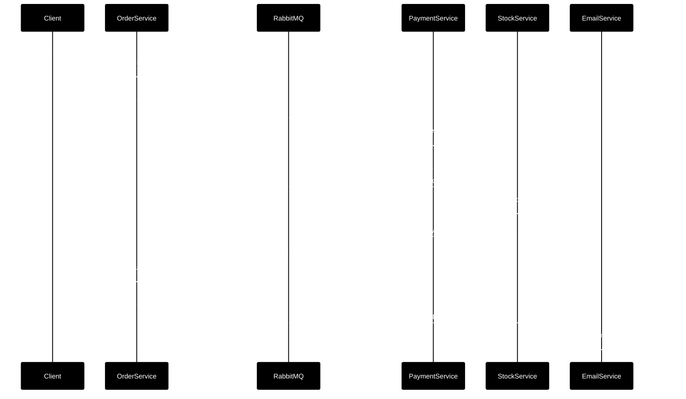
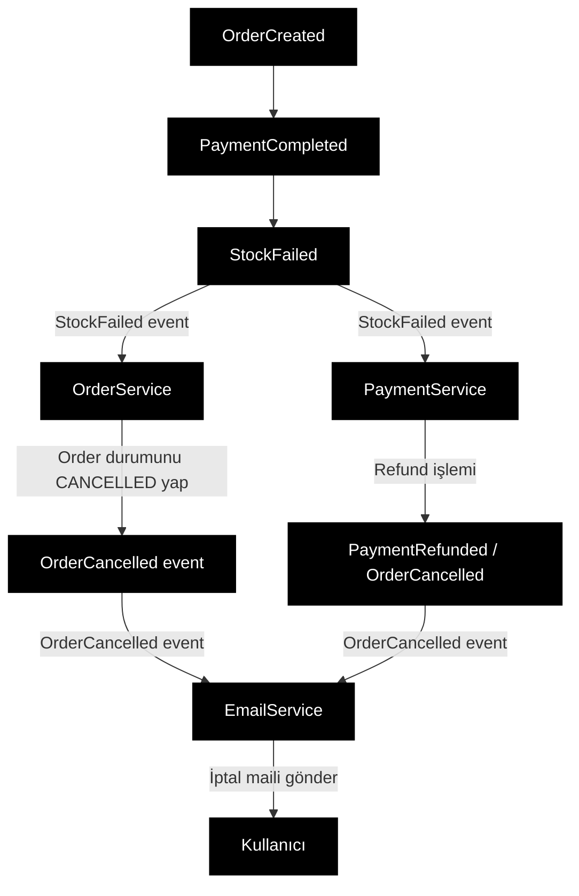

# RabbitMQ Temel Kavramlar

---

# 1. RabbitMQ nedir, ne işe yarar?

**Kısa tanım:**

RabbitMQ, uygulamalar arasında **mesaj taşıyan bir "mesaj aracısı" (message broker)**'dır. Uygulamalar mesajları RabbitMQ'ya gönderir, RabbitMQ bu mesajları uygun **kuyruklara** koyar ve oradan **tüketicilere (consumer)** iletir.

* **Kendisi bir sunucu / servis** (Docker container, Windows servisi vs.).

* Sen .NET ile yazdığın uygulamada sadece bir **client kütüphanesi** (örneğin `RabbitMQ.Client`) kullanarak bu sunucuya bağlanırsın.

> Yani RabbitMQ bir "NuGet paketi" **değil**;

> Redis'te `redis-server` + `StackExchange.Redis` ikilisi gibi düşün:

> RabbitMQ → server, `RabbitMQ.Client` → client.

---

# 2. Felsefe: Neden HTTP yerine RabbitMQ kullanıyoruz?

Klasik senaryo:

* `OrderAPI`, iş yaptırmak için `PaymentAPI`'yi **HTTP ile senkron** çağırıyor.

* `PaymentAPI` yavaşsa:

  * `OrderAPI` thread'leri bekler, gecikme artar.

  * `PaymentAPI` çökerse, `OrderAPI` de hata döner.

* Yük artınca, bütün sistem birbirini sürükleyip çökertir → **sıkı sıkıya bağlı (tightly coupled)** sistem.

RabbitMQ'nun felsefesi:

> "Servisler birbirine doğrudan bağlanmasın,

> mesajı bana versin, ben sıraya koyup doğru servise ileteyim."

Ne kazanıyoruz?

1. **Gevşek bağlılık (loose coupling)**

   * `OrderService` sadece **event yayınlar**: "OrderCreated".

   * Kimin dinlediğini bilmez (Payment mi, Stock mu, Mail mi…).

2. **Asenkron çalışma**

   * HTTP isteğine hızlıca "sipariş alındı" diyebilirsin.

     Ağır işler (ödeme, mail, stok) arkada kuyruktan işlenir.

3. **Buffer / backpressure**

   * Ani yükte mesajlar kuyrukta birikir, worker'lar sırayla tüketir.

     Sistem "patlamaz", sadece işlenme süresi uzar.

4. **Dayanıklılık (reliability)**

   * Doğru ayarlarla mesajlar disk üzerinde saklanır.

   * Consumer çökerse veya broker restart olursa mesajlar kaybolmaz.

---

# 3. Temel kavramlar (postane metaforu ile)

RabbitMQ, AMQP modelini kullanıyor: **publisher → exchange → queue → consumer**.

## 3.1 Broker

* **RabbitMQ sunucusunun kendisi**.

* Adres: `amqp://localhost:5672` gibi.

* Birden fazla **virtual host (vhost)** içinde exchange, queue vb. barındırır.

Metafor: **PTT'nin binası**.

---

## 3.2 Message (Mesaj)

* Taşınan veri paketi. Genelde JSON, XML, string, binary…

* Örn: `{"orderId": 123, "userId": 5, "total": 150.0}`.

* Mesajın **gövdesi (body)** + bazı **header/properties** alanları olur.

Metafor: **Zarf**.

---

## 3.3 Producer (Publisher)

* Mesajı **gönderen uygulama**.

* Örn: `OrderService`, sipariş oluştuğunda "OrderCreated" mesajı gönderir.

Metafor: PTT'ye zarfı veren kişi.

---

## 3.4 Consumer (Subscriber)

> "Sürekli kuyrukta var mı diye mi bakıyor?" sorunun cevabı da burada.

* Mesajı **alan ve işleyen uygulama**.

* Örn: `EmailService`, sırf mail atmak için `email-queue`'yu dinler.

RabbitMQ'de iki tüketim şekli var:

1. **Push modeli (temel olan) – `basic.consume`**

   * Consumer, kuyruğa **abonelik (subscription)** başlatır.

   * RabbitMQ, kuyruğa mesaj geldikçe o consumer'a **PUSH eder**.

   * Yani consumer "sürekli while(true) queue var mı?" diye sormaz;

     soket açık durur, mesaj gelince event/callback tetiklenir.

2. **Pull modeli – `basic.get`**

   * "Şu anda bir mesaj var mı?" diye **tek seferlik** sorgu atar.

   * Kuyruk boşsa `get-empty` döner, tekrar sorman gerekir.

   * CloudAMQP ve resmi kaynaklar, performans ve maliyet nedeniyle

     **sık kullanılan iş yüklerinde push modelini tavsiye ediyor**.

> Yani **gerçek hayatta** microservice/worker yazarken:

>

> * Servis bir kez `BasicConsume` ile kuyruğa abone olur,

> * RabbitMQ yeni mesajları **otomatik iter**,

> * Sen event içinde işlersin.

---

## 3.5 Queue (Kuyruk)

Resmi tanım:

> "Queue, FIFO (first in, first out) mantığıyla çalışan, mesajları sıralı tutan bir veri yapısıdır."

* Producer tarafından gönderilen mesajlar **kuyruğa eklenir (enqueue)**.

* Consumer'lar hazır oldukça kuyruğun **başından alınır (dequeue)**.

* Queue, aynı mesajı **birden fazla consumer'a değil**,

  genelde **bir consumer grubuna sırayla** dağıtır (work queue senaryosunda).

**Mesaj nerede tutuluyor?**

* RabbitMQ, kuyrukları RAM + disk kombinasyonuyla yönetir:

  * **Durable queue** + **persistent message** ise:

    * Mesaj disk'e yazılır, broker restart olsa bile geri gelir.

  * Geçici queue / transient message ise:

    * Performans için daha "hafif" tutulur ama restart'ta kaybolabilir.

> Özet: Mesajlar **kuyruklarda saklanır**;

> kalıcı olsun mu olmasın mı, senin `durable` + `persistent` ayarına bağlı.

---

## 3.6 Exchange

Resmi tanım:

> "Publisher'ların mesajlarını gönderdiği yerdir; exchange mesajları binding kurallarına göre uygun kuyruk(lar)a yönlendirir."

* Producer **doğrudan kuyruğa değil**, **exchange**'e publish eder.

* Exchange, mesajın header'larına, routing key'ine ve kendi tipine göre:

  * 0, 1 veya N tane kuyruğa mesaj kopyalar.

Başlıca exchange tipleri (detaya boğmadan):

* **Direct** → routing key tam eşleşen kuyruğa gönderir.

* **Fanout** → "kim bağlıysa hepsine gönder" (broadcast).

* **Topic** → routing key pattern (`order.*`, `*.created`) ile eşleşenlere gönderir.

* **Headers** → header alanlarına bakar.

Metafor: PTT'nin ortasındaki **ayırma masası**:

"İstanbul zarfları şuraya, Ankara şuraya."

---

## 3.7 Binding & Routing Key

**Binding:**

* Bir exchange ile bir queue arasındaki **kural/bağlantı**.

* "Bu kuyruğu, şu exchange'e, şu koşulla bağla" der.

**Routing Key:**

* Mesajın **adres alanı** gibi.

* Producer mesaj gönderirken `routingKey = "order.created"` diyebilir.

* Exchange, binding'lere bakar:

  * "Kimler `order.created` ile bağlanmış?" → o kuyruk(lar)a gönderir.

---

## 3.8 Connection & Channel

* **Connection:**

  * Uygulaman ile RabbitMQ arasındaki **TCP bağlantısı**.

* **Channel:**

  * Connection içinde açılan **hafif "mantıksal" kanal**.

  * Aynı TCP üzerinden birden fazla channel açıp farklı işler için kullanabilirsin.

Pratik .NET dünyası:

* Genelde uygulama başlarken **1 connection** açarsın.

* Aynı connection üzerinden 1+ channel ile publish/consume yaparsın.

---

## 3.9 Virtual Host (vhost)

* RabbitMQ içinde mantıksal "namespace" gibi:

  * Her vhost'un kendi exchange, queue, user yetkileri var.

* Aynı fiziksel broker'ı birden fazla proje / takım paylaşabilir.

Metafor: Aynı PTT binasında farklı "bölümler".

---

## 3.10 Consumer Acknowledgement (Ack) & Publisher Confirms

### Consumer Ack

* Consumer, mesajı aldıktan sonra işler (DB yaz, HTTP çağır, mail gönder…).

* İş başarılıysa `basic.ack` gönderir:

  * RabbitMQ o mesajı kuyruktan **kalıcı olarak siler**.

* Consumer çöker / hata olur ve ack göndermezse:

  * Mesaj **tekrar kuyruğa dönebilir** ve başka consumer tarafından alınabilir.

Bu sayede:

> "Consumer ölürse mesaj kaybolmasın" garantisi verirsin.

### Publisher Confirms (yayıncı teyidi)

* Producer bir mesajı gönderdiğinde RabbitMQ'nun:

  * "Mesajı **güvenli şekilde aldım** (ve gerekiyorsa disk'e yazdım)" diye,

  * Publisher'a onay göndermesidir.

Consumer ack + durable queue + persistent message + publisher confirms

→ **uçtan uca güvenli mesaj teslimi** için klasik best-practice.

---

# 4. Genel mesaj akışı (soyut diyagram)

RabbitMQ'nun resmi konsept diyagramı da böyle anlatır:

```mermaid
flowchart TD
    A[Producer Uygulama] -->|1) Publish<br/>exchange + routingKey + body| B[Exchange]
    B -->|2) Binding kurallarına göre| C[Queue'lar]
    C -->|3) Consumer'lara teslim| D[Consumer Uygulamalar]
    D -->|4) İşler + ACK gönderir| E[RabbitMQ]
    E -->|Mesaj silinir| C
    
    style A fill:#f5f5f5
    style B fill:#fafafa
    style C fill:#f0f0f0
    style D fill:#f5f5f5
    style E fill:#fafafa
```

* Producer **kime gideceğini bilmez**, sadece exchange + routing key verir.

* Exchange, hangi kuyruğa gideceğine **binding + routing key** ile karar verir.

* Queue, mesajı **tutar**; consumer'a verilip ACK gelene kadar silinmez.

* Consumer, işini bitirince ACK gönderir.

---

# 5. "Consumer mesaj olduğunu nasıl anlıyor?"

Senin sorunu net cevaplayalım:

> "Burada sürekli bir kontrol yapması gerekmiyor mu?

> Sürekli kuyrukta var mı diye?"

* Worker servis (örneğin `EmailService`) açılırken:

  * RabbitMQ'ya bağlanır,

  * `email-queue` için `BasicConsume` çağırır → **abone olur**.

* RabbitMQ:

  * "Bu kuyruğu dinleyen şu consumer var" diye kayıt tutar.

* Kuyruğa yeni mesaj gelince:

  * RabbitMQ bu consumer'a **PUSH ederek** entregeler.

  * Yani **consumer polling yapmaz**; mesaj "kapıya gelir".

---

# 6. E-ticaret örneği: paralel akış vs sıralı akış

Şimdi kafanı en çok kurcalayan yere gelelim:

**Order → Payment → Stock → Email** ilişkisi.

## 6.1 Basit "paralel" senaryo (tek event, üç servis)

En basit kurulum:

* Exchange: `orders-exchange`

* Kuyruklar:

  * `payment-queue`  → `PaymentService`

  * `stock-queue`    → `StockService`

  * `email-queue`    → `EmailService`

* Hepsi `routingKey = "order.created"` ile exchange'e bağlı.

Akış:

```mermaid
flowchart TD
    A[Client] -->|1) POST /orders| B[OrderAPI]
    B -->|2) Order'ı DB'ye yaz<br/>PENDING| B
    B -->|3) OrderCreated event| C[orders-exchange]
    
    C -->|4) order.created mesajını<br/>3 kuyruğa kopyalar| D[payment-queue]
    C -->|4) order.created mesajını<br/>3 kuyruğa kopyalar| E[stock-queue]
    C -->|4) order.created mesajını<br/>3 kuyruğa kopyalar| F[email-queue]
    
    D -->|Mesaj teslim| G[PaymentService<br/>ödeme]
    E -->|Mesaj teslim| H[StockService<br/>stok]
    F -->|Mesaj teslim| I[EmailService<br/>mail]
    
    G -->|ACK| D
    H -->|ACK| E
    I -->|ACK| F
    
    style A fill:#f5f5f5
    style B fill:#fafafa
    style C fill:#f0f0f0
    style D fill:#f5f5f5
    style E fill:#f5f5f5
    style F fill:#f5f5f5
    style G fill:#fafafa
    style H fill:#fafafa
    style I fill:#fafafa
```

Burada:

* Üç servis de aynı `OrderCreated` event'inin **kendi kopyasını** alıyor.

* Herkes ayrı kuyruk dinlediği için **bağımsız & paralel**:

  * Önce payment çalışabilir, önce mail gidebilir, sıranın garantisi yok.

* RabbitMQ:

  * "Hepsi başarılı olsun / biri hatalıysa diğerini geri al" gibi **iş kuralı bilmez**.

Bu nedenle, **iş sırası ve tutarlılık** senin için önemliyse bu model yetmez.

---

## 6.2 Sıralı akış (Payment → Stock → Email) için event zinciri

> "Sırasını nereden, nasıl belirliyoruz?"

> Cevap: **Event zincirini sen tasarlıyorsun**; RabbitMQ sadece taşıyor.

Servisler:

* **OrderService** (OrderAPI):

  * Sipariş DB'ye `PENDING` yazar.

  * `OrderCreated` event'ini yayınlar.

  * Sonraki event'leri dinler; order durumunu günceller.

* **PaymentService**:

  * `OrderCreated` event'ini dinler.

  * Ödeme çeker.

  * Başarılıysa `PaymentCompleted`, başarısızsa `PaymentFailed` yayınlar.

* **StockService**:

  * `PaymentCompleted` event'ini dinler.

  * Stok düşer, başarılıysa `StockReserved`, hata varsa `StockFailed` yayınlar.

* **EmailService**:

  * `OrderCompleted` ve `OrderCancelled` event'lerini dinler.

  * Başarılı / başarısız senaryolarda kullanıcıya mail yollar.

### Sıralı, başarılı senaryo diyagramı



Burada **sıra** şu şekilde oluşuyor:

* PaymentService **sadece** `OrderCreated` dinliyor → ilk o devreye giriyor.

* StockService **sadece** `PaymentCompleted` dinliyor → ikinci adım.

* EmailService, `OrderCompleted` dinliyor → en son.

Yani:

> **Sıra, hangi servis hangi event'i dinliyor ve hangi event'i üretiyor

> zincirinden geliyor.**

> RabbitMQ bu sırayı **zorlamaz**, sadece event'leri ilgili kuyruklara yollar.

---

## 6.3 Hata senaryosu: Payment OK, Stock FAIL

Senin sorduğun kritik durum:

> "Sipariş DB'ye yazıldı, Payment başarılı, Email gitti diyelim;

> ama StockService'de hata oldu. Bu iş nasıl toparlanıyor?"

Parçalayalım.

### 6.3.1 RabbitMQ açısından

`StockService` tarafında hata:

* `stock-queue`'dan mesajı aldı ama:

  * İşlemi bitirmeden crash oldu veya hata fırlattı.

  * ACK göndermedi.

* RabbitMQ bu mesajı **unacked** olarak görür.

* Consumer bağlantısı kapanırsa veya nack/requeue isterse:

  * Mesaj **tekrar kuyruğa konur** → başka instance veya tekrar aynı servis alabilir.

Yani "StockService çöktü, mesaj kayboldu" olmaz;

ama bu sadece **teknik teslimat garantisi**.

### 6.3.2 İş kuralı açısından (Saga Pattern)

Burada devreye **Saga Pattern** giriyor:

> Saga = Dağıtık transaction'ı küçük adımlara bölmek,

> her adım başarısız olduğunda önceki adımları **telafi (compensation)** ile geri almak.

Stock başarısız olduğunda yapılacaklar:

* `StockService`:

  * Stok düşemedi → `StockFailed` event yayınlar.

* `OrderService`:

  * `StockFailed`'i dinler → order durumunu `CANCELLED` yapar, `OrderCancelled` yayınlar.

* `PaymentService`:

  * `StockFailed` veya `OrderCancelled` event'ini dinleyip

    **"refund" (iade)** işlemini yapar.

  * `PaymentRefunded` event'i yayınlayabilir.

* `EmailService`:

  * `OrderCancelled` event'ini dinler,

    "Sipariş tamamlanamadı, ücret iade edildi" maili gönderir.

Bunun diyagramı kabaca şöyle olur:



Önemli nokta:

* **RabbitMQ, bunların hiçbir "iş kuralını" bilmiyor.**

* Sadece event'leri:

  * Doğru kuyruğa koyuyor,

  * Mesaj kaybolmasın diye saklıyor,

  * Consumer ACK'lerine göre tekrar deniyor.

* "Ödeme yapıldıysa stok düşmeden sipariş tamamlanmasın, hata olursa refund yap"

  tarzı kurallar **tamamen senin servislerindeki event tasarımına** ait.

---

# 7. Crash / restart durumlarında güvenlik

Özetle, RabbitMQ'nun güvenilirlik tarafı şu üçlüye dayanıyor:

1. **Durable Queue**

   * Queue tanımı disk'te saklanır,

   * Broker restart sonrası yeniden oluşur.

2. **Persistent Message**

   * Mesaj, disk'e yazılır.

   * Reboot / crash sonrası geri gelir.

3. **Consumer Ack**

   * Consumer iş bitmeden ACK vermez.

   * ACK yoksa mesaj "teslim edildi" sayılmaz, gerekirse yeniden gönderilir.

Ve istersen:

4. **Publisher Confirms**

   * Producer, broker'in mesajı güvenli şekilde aldığından **emin olur**.

Bu sayede:

* **Broker restart olsa bile**:

  * Kalıcı queue + persistent message + confirm ile

    mesajlar **tekrar kuyruğa gelir**.

* **Consumer ölse bile**:

  * ACK gelmediği için mesaj **yeniden** tüketiciye verilir.

---

# 8. .NET tarafından çok kısa bakış

Detaya girmeden büyük resmi söyleyeyim:

* NuGet'ten `RabbitMQ.Client` paketini kullanırsın.

* Genelde bir **ConnectionFactory** ile bağlanırsın:

  * `factory.CreateConnection()` → `connection.CreateModel()` ile channel.

* Başlangıçta:

  * İhtiyaç duyduğun **exchange ve queue'ları declare** edersin.

  * **Binding** ayarlarını yaparsın.

* Mesaj gönderirken:

  * `channel.BasicPublish(exchange, routingKey, props, body)`.

* Mesaj dinlerken:

  * `var consumer = new EventingBasicConsumer(channel);`

  * `channel.BasicConsume(queue, autoAck: false, consumer);`

  * `consumer.Received` event'inde:

    * İşle,

    * Hata yoksa `channel.BasicAck(...)` çağır.

Bunların hepsi, anlattığımız **felsefe ve akışın kod karşılığı** aslında.

---

# 9. Worker nedir?

**"Worker" dediğimiz şey, arka planda çalışan, kuyruğu dinleyip işi yapan servis / programdır.**

Yani senin API'nden farklı olarak, **kullanıcıdan HTTP isteği beklemez**, genelde **mesaj / job bekler.**

## 9.1 Worker nedir?

Genel dünyada ve .NET tarafında **worker**:

* Sürekli çalışan bir **arka plan uygulaması**dır.

* Genellikle:

  * Kuyruk dinler (RabbitMQ, Azure Queue, SQS…),

  * Zamanlanmış işler yapar (cron gibi),

  * Uzun süren, ağır işlemleri üstlenir (mail, rapor, video işleme…).

Farkı:

* **API (Web uygulaması)**

  * Kullanıcıdan / başka servisten **HTTP isteği bekler**.

  * İstek gelir → iş yapar → cevap döner.

* **Worker**

  * Kuyruktan / scheduler'dan **mesaj bekler**.

  * Mesaj gelir → iş yapar → çoğu zaman kullanıcıya direkt cevap dönmez.

---

## 9.2 RabbitMQ bağlamında worker ne?

RabbitMQ tarafında:

* `PaymentService` (ödemeyi yapan),

* `StockService` (stok düşen),

* `EmailService` (mail atan)

gibi servisler **genelde worker** şeklinde çalışır:

* Uygulama açılırken:

  * RabbitMQ'ya bağlanır,

  * Örneğin `payment-queue`'ya `BasicConsume` ile abone olur.

* Sonra bekler…

  Kuyruğa mesaj geldikçe RabbitMQ **o worker'a mesajı iter**.

* Worker:

  * Mesajı alır,

  * İşini yapar (ödeme, stok, mail),

  * Bittiyse RabbitMQ'ya **ACK** gönderir.

Yani:

> Worker = "kuyruğu dinleyen ve gelen işi arka planda yapan servis".

---

## 9.3 .NET dünyasında "Worker Service" ne demek?

Sen .NET yazıyorsun, oradaki karşılığı:

* `dotnet new worker` komutuyla oluşturduğun,

* **Web API olmayan**,

  arka planda dönen bir `.NET Generic Host` uygulaması.

Bu Worker Service'in içinde:

* `BackgroundService` türeten bir sınıf yazar,

* `ExecuteAsync` içinde RabbitMQ kuyruğunu dinlersin:

```csharp
public class PaymentWorker : BackgroundService
{
    protected override Task ExecuteAsync(CancellationToken stoppingToken)
    {
        // 1) RabbitMQ'ya bağlan
        // 2) payment-queue'ya BasicConsume ile abone ol
        // 3) consumer.Received event'inde ödeme işlemlerini yap
    }
}
```

Bu uygulamayı:

* Docker container olarak,

* Windows Service olarak,

* Linux'ta systemd ile

arka planda sürekli çalıştırırsın. İşte bu, **worker**.

---

# 10. Tek cümlelik zihinsel model

> **RabbitMQ = uygulamaların birbirini doğrudan çağırmak yerine,

> mesajları bıraktığı güvenilir bir "mesaj postanesi".**

* Mesajlar **exchanges → queues** üzerinden akar.

* **Producer** sadece "şu olay oldu" der.

* **Consumer** sadece "şu kuyruğu dinliyorum, işimi yaparım" der.

* **Sıralama ve iş kuralları**,

  event'lerin nasıl zincirlendiği ve hangi servislerin hangi event'i dinlediğiyle belirlenir (Saga / event-driven design).

* RabbitMQ ise:

  * Mesajı kaybetmemek,

  * Doğru kuyruklara yönlendirmek,

  * Consumer çökse bile tekrar denemek

    gibi **altyapı problemlerini çözer**.

---

# 11. Özet

* 🔹 **RabbitMQ nedir?**
  Uygulamalar arasında mesaj taşıyan bir mesaj aracısı (message broker). Server + client kütüphanesi ikilisi.

* 🔹 **Neden kullanırız?**
  Gevşek bağlılık, asenkron çalışma, buffer/backpressure, dayanıklılık sağlar. HTTP yerine mesajlaşma ile servisler birbirine sıkı sıkıya bağlı olmaz.

* 🔹 **Temel kavramlar:**
  * **Broker**: RabbitMQ sunucusu
  * **Producer/Publisher**: Mesaj gönderen
  * **Consumer/Subscriber**: Mesaj alan ve işleyen
  * **Queue**: Mesajların tutulduğu kuyruk
  * **Exchange**: Mesajları kuyruklara yönlendiren yapı
  * **Binding & Routing Key**: Exchange-queue bağlantı kuralları
  * **Connection & Channel**: TCP bağlantısı ve mantıksal kanal
  * **Virtual Host**: Mantıksal namespace
  * **Ack & Publisher Confirms**: Güvenilirlik mekanizmaları

* 🔹 **Mesaj akışı:**
  Producer → Exchange → Queue → Consumer → ACK

* 🔹 **Worker nedir?**
  Arka planda çalışan, kuyruğu dinleyip iş yapan servis. HTTP isteği beklemez, mesaj bekler.

* 🔹 **.NET tarafında:**
  * `RabbitMQ.Client` NuGet paketi
  * `ConnectionFactory` ile bağlantı
  * `BasicPublish` ile mesaj gönderme
  * `BasicConsume` ile mesaj dinleme
  * Worker Service pattern ile arka plan işlemleri

