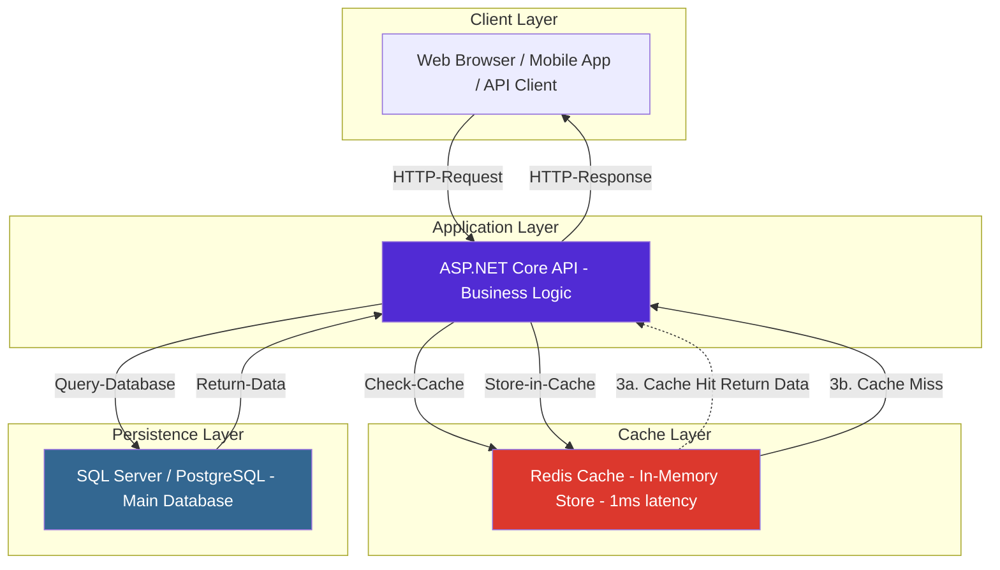
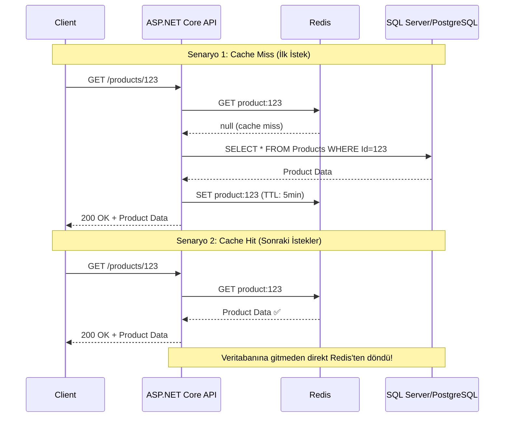
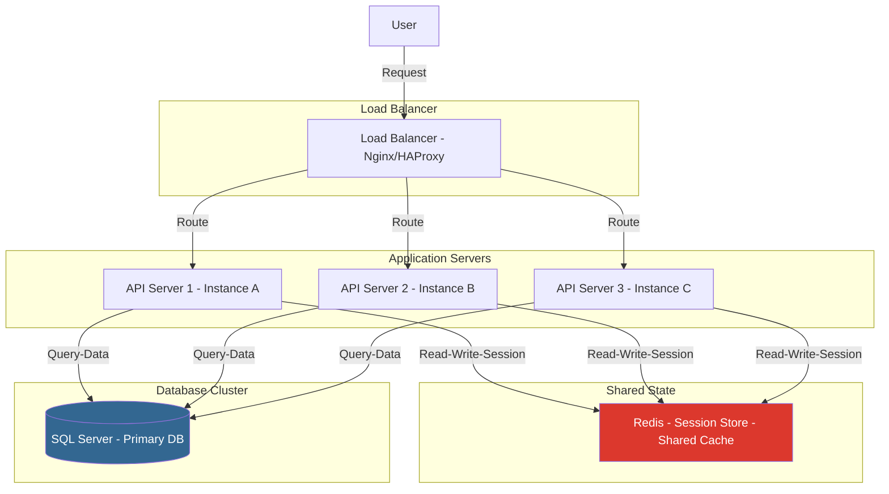
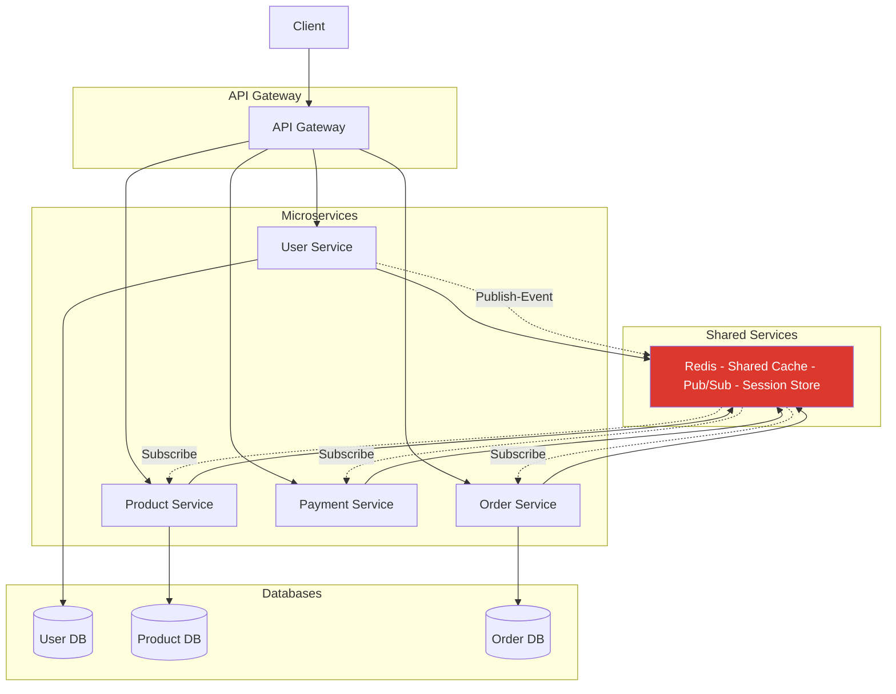
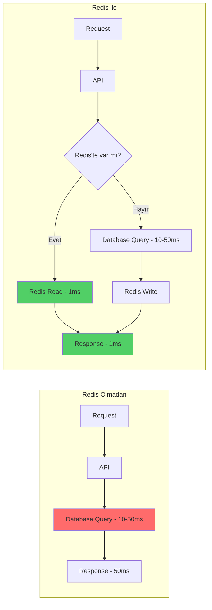
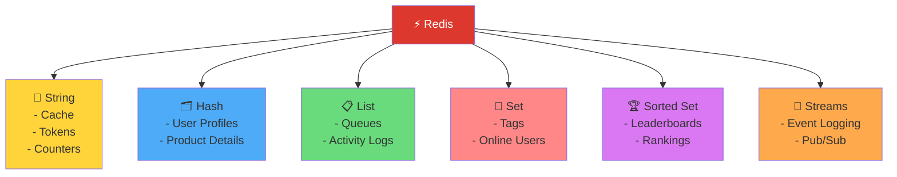
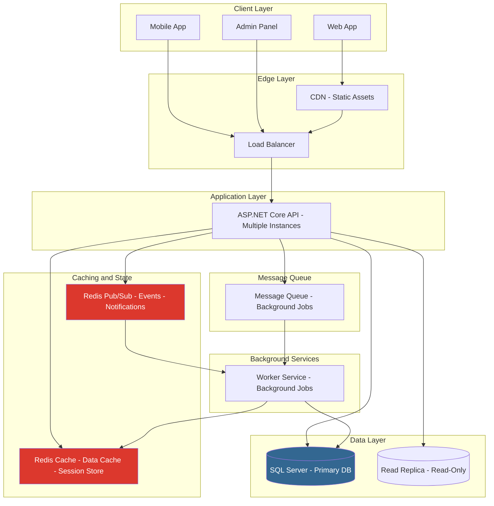
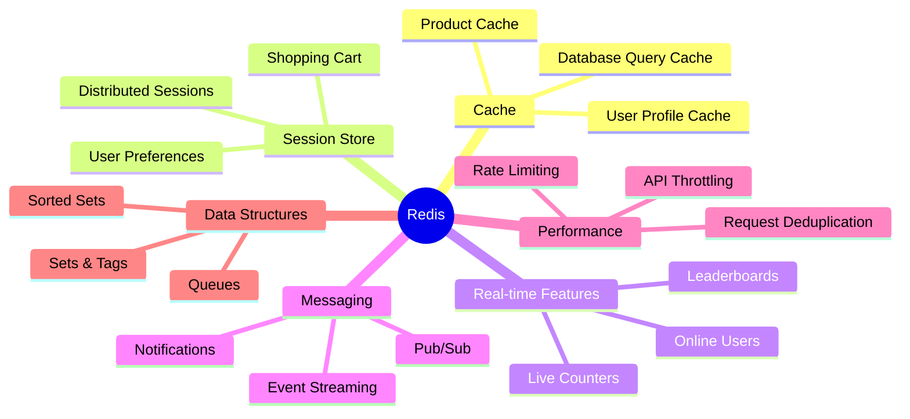

# Redis Mimari Diyagramları

Redis'in bir projedeki konumu, görevi ve farklı senaryolardaki kullanımı.

---

## 1️⃣ Temel Cache Senaryosu (Cache-Aside Pattern)

Redis'in en yaygın kullanımı: uygulama ile veritabanı arasında cache katmanı.

**Akış:**
1. Client → API'ye istek gönderir
2. API → Önce Redis'te cache kontrolü yapar
3a. **Cache Hit:** Redis'te veri varsa → direkt döner (çok hızlı!)
3b. **Cache Miss:** Redis'te veri yoksa → veritabanına gider
4. Veritabanından veri çekilir
5. Veri hem API'ye döner hem de Redis'e yazılır (gelecek istekler için)
6. API → Client'a yanıt gönderir

---

## 2️⃣ Detaylı Cache Akış Diyagramı

Cache miss ve cache hit senaryolarının detaylı gösterimi.

---

## 3️⃣ Session Store Senaryosu

Çoklu server ortamında merkezi session yönetimi.

**Fayda:** Kullanıcı hangi server'a istek gönderirse göndersin, session bilgisi Redis'te merkezi olarak tutulduğu için aynı kullanıcı oturumuna erişir.

---

## 4️⃣ Microservices Architecture

Mikroservisler arası veri paylaşımı ve event-driven communication.

**Redis'in Rolleri:**
- **Shared Cache:** Tüm servislerin erişebileceği ortak cache
- **Pub/Sub:** Servisler arası event mesajlaşması
- **Session Store:** Merkezi oturum yönetimi

---

## 5️⃣ Redis vs Database Karşılaştırmalı Akış

Performans farkını gösteren karşılaştırma.

**Performans Karşılaştırması:**
- **Redis olmadan:** Her istek → DB → ~10-50ms
- **Redis ile (cache hit):** İstek → Redis → ~1ms (**10-50x daha hızlı!**)
- **Redis ile (cache miss):** İlk istek DB'ye gider, sonrakiler Redis'ten gelir

---

## 6️⃣ Redis Veri Yapıları Kullanım Senaryoları

**Kullanım Örnekleri:**
- **String:** `"user:1:name" → "Kamil"`, `"session:abc123" → JSON`
- **Hash:** `"user:1" → {name: "Kamil", age: "23", email: "..."}`
- **List:** `"queue:orders" → [order1, order2, order3]`
- **Set:** `"online:users" → {user1, user2, user3}`
- **Sorted Set:** `"leaderboard" → {(kamil, 100), (ahmet, 80)}`
- **Streams:** Event sourcing, audit log

---

## 7️⃣ Tam Stack Architecture Örneği

Gerçek bir production ortamı örneği.

**Redis'in Bu Mimarideki Rolleri:**
1. **Data Cache:** Sık kullanılan verileri cache'ler
2. **Session Store:** Kullanıcı oturumlarını merkezi tutar
3. **Pub/Sub:** Gerçek zamanlı event/mesajlaşma
4. **Rate Limiting:** API rate limit sayaçları
5. **Distributed Lock:** Kritik işlemler için lock mekanizması

---

## 8️⃣ Redis Kullanım Senaryoları Özet

---

## 📊 Özet: Redis'in Projedeki Yeri

| Özellik | Değer |
|---------|-------|
| **Konumu** | Application Layer ile Database Layer arasında |
| **Türü** | In-Memory Data Structure Store |
| **Latency** | ~1ms (sub-millisecond) |
| **Ana Kullanım** | Cache, Session, Pub/Sub, Real-time Data |
| **Veri Kalıcılığı** | İsteğe bağlı (genelde geçici) |
| **Scalability** | Horizontal scaling (cluster mode) |
| **HA (High Availability)** | Redis Sentinel, Redis Cluster |

**Redis = Veritabanının yanında çalışan, hız için RAM kullanan, akıllı bir yardımcı servis.**

